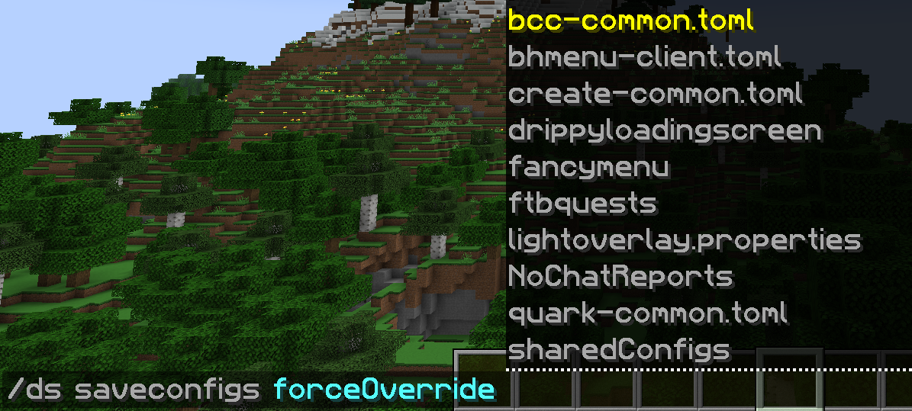

# Configuring DefaultSettings
## Basic Configuration
1. Run the pack at least once after installing DefaultSettings, then exit.
2. Open your file manager to "minecraft/config/defaultsettings" Ignore the following:
- config/defaultsettings/sharedConfigs
- config/defaultsettings/sharedConfigs/ignore.json
3. Copy all modded config files and folders to include in your modpack to "config/defaultsettings/Default/" as shown in the example. 
4. Start Minecraft and create or open an existing world.
5. Run the command "/ds save [override option]" - only works for options, servers.dat, resourcepacks, etc.
- "/ds save" Is the default and will only save files that do not exist yet. If a file exists, it won't touch it. **This is probably the best option for new pack installations**
- "/ds save -o" Override option enforces your new configs for new modpack users.
- "/ds save -of" Force Override option includes any existing users.
- "/ds" generates the file "config/defaultsettings.json" and copies the following files to "config/defaultsettings/Default/":
- keys.txt
- options.txt
- servers.dat
6. Export your pack and only include the following from the "minecraft/config" folder:
- config/defaultsettings/
- config/defaultsettings.json
- 
7. **Do NOT export the "ds_private_storage.json"** (.minecraft/ds_private_storage.json) file will break the pack.
8. Test your modpack install zip file.

## Advanced "/ds saveconfigs"
- "/ds saveconfigs" **Please provide me with an explanation for this**
- "/ds saveconfigs forceOverride [folder/file]" Select individual files/folders the player cannot alter. Any attempt to edit a file will revert to your predetermined settings.
- 

## Updating Your Pack
Run the appropriate "/ds" commands after each pack update to generate new hashes. Note each command run for future reference.

*All "/ds" commands use tab completion.*